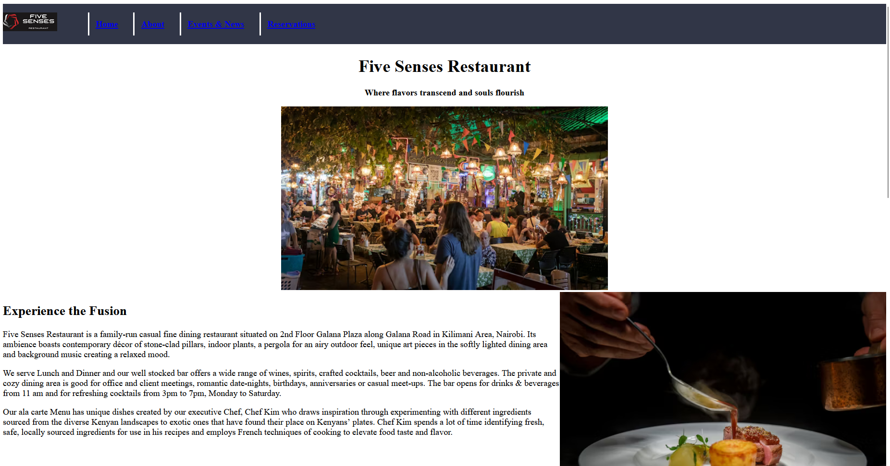
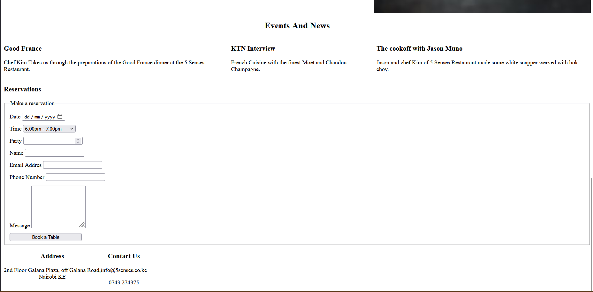

# Five Senses Restaurant Landing Page

## Contributor
- Isaac Ndungu

## Project Brief
This project is a landing page for Five Senses Restaurant. Five Senses Restaurant is a family-run casual fine dining restaurant situated on 2nd Floor Galana Plaza along Galana Road in Kilimani Area, Nairobi. 

## Technologies Used
* HTML5
* CSS
* Git

## Usage Instructions
1. Clone the project files
2. Open `index.html` in any web browser to view the landing page

## Screenshots

## Business Rationale
This landing page introduces the Five Senses Restaurant to customers. The landing page will help improve the brand positioning of the restaurant. 